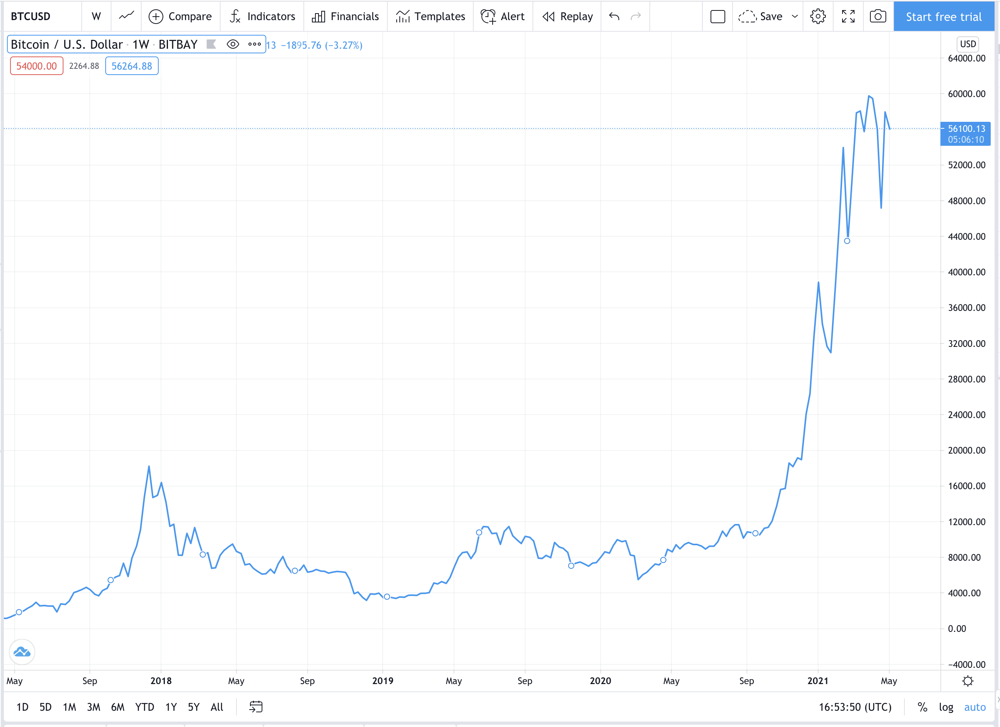

# Fintech Case Study - Coinsquare

---

## **Overview & Origin**

Today, it's unlikely that someone hasn't learned about cryptocurrencies. Cryptocurrency, according to investopedia is a digital (virtual) currency protected through cryptography, making it impossible to counterfeit or double spend. Generally, cryptocurrencies are based on blockchain technology –a distributed ledger maintained on decentralized network of computers on the internet. Cryptocurrencies are distinct from fiat money, in that they are not issued by Central Banks and thus could be immune to government interference.

Bitcoin (BTC/USD),also known as the bellwether of the cryptocurrency industry, has grown from $1000 in 2015 to $ 56,000 today. This has piqued the interest of main street investors, creating the need for trading platforms.

*Exhibit 1.0 Bitcoin Weekly chart*
*Source Tradingview.com*

---

**Coinsquare** is a trading platform that allows users to buy and sell several cryptocurrencies. It lists 10 separate cryptocurrencies and quotes them against 5 different fiat currencies, at the time of this writing in May 2021. Since, its inception in 2014, the company has prided itself on proprietary technology that promises best in class security.

**Cryptocurrencies on Coinsquare**:
Bitcoin, Ethereum, Litecoin, Bitcoin Cash ABC,  Bitcoin Cash SV, Dogecoin, Dash, Ripple, Ethereum Classic, Stellar

**Fiat Currencies supported on Coinsquare**:  
USD, CAD, EUR, GBP, CHF

Coinsquare users are provided with wallet address to keep track of holdings in cryptocurrencies. The company has strong ledger system that keep track of every coin traded on its platform on daily basis. Additionally, 95% of all funds are stored offline in cold wallets, which are less vulnerable to hacking

---

### **Founders & Origin Story**

     

Cole Diamond  and Virgile Rostand founded Coinsquare in 2014. In 2004, Rostand graduated with Master of Science in Mathematics. He further earned a Ph.D. in the same field of study, as well as a Master in Mathematical Finance from the University of Toronto. In 2008, in the backdrop of Great financial Crisis, Satoshi Nakamoto (anonymous creator) published a paper titled “Bitcoin :  A Peer-to-Peer Electronic Cash System”, which gave rise world’s first decentralized cryptocurrency Bitcoin. The paper delineated a peer-to-peer electronic payment system without the need for trusted third party.
As blockchain technology started to get traction, Rostand with his background in mathematics and experience as financial engineer, found it  difficult to ignore this trend.  In  2014, he recognized the growing demand for cryptocurrency exchanges, incorporated Coinsquare.  Following the launch of platform, he carried out various functions like marketing, security analysis and support. It not until 2017, when co-founder  CEO Cole Diamond, the company started its journey towards its ambitious goal.

#### **No of Employees:** 100+

#### **Headquarters:** Toronto, Canada

#### **CEO:** Stacey Hoisak

### **Funding**
Coinsquare has raised approx. $98.5 million  of funding over 6 rounds. The lastest round came in Feb 2021 from Corporate round. The company is funded by 4 investors. Mogo and Canaccord  Genuity Group are recent investors. The most recent was from Mogo, a digital payments and financial technology company for 19.99% stake in Coinsquare for a total consideration of approx. $56.4 million.
---

### **Acquistions**
The company has made 5 acquistions to enhance its capabilities

|Company   | Announcement Date  | Details |
|:---------|:------------------:|:---------|
|Just.Cash | July 2019 | Just.Cash is mobile application that allows users to purchase cryptocurrency through ATM |
|Cryptiv | March 2019 | Cryptiv's enterprise blockchain wallet system allows traditional firms to handle blockchain enabled digital assets |
|StellarX | February 2019 | StellarX is an online platform that offers trading solutions for businesses |
|Koi Loyalty | February 2019 | Koi Loyalty is a digital currency payment & loyalty solution provider |
|BlockEQ | December 2018 |BlockEQ is a cryptocurrency wallet that empowers users to buy, trade, and hold cryptocurrencies in a secure manner |

---

## **Business Landscape**
---
---
### **Vision**
The company vision to be one stop shop for all trading of digital assets and other services related to these assets. 
---
---
### **Business Services**
Coinsquare offers 4 services

1.	**Capital Markets:** core business, that seeks to simplify trading of cryptocurrencies. Its value proposition comes from providing its customers –ease of trading, accessibility and security.
2.	**Mining:** offers value by creating digital mining ecosystem – mining pools, hash rate, proof of stake and mining pool marketplace. 
3.	**Coincapital:** offers investment products that focus on emerging technologies -blockchain, digital currencies, AI, and robotics. 
4.	**Licensing:**  Coinsquare enables its clients to open trading sites in their own countries based on its proprietary software through licensing agreements. The company has expanded into Europe and Japan through these agreements.
5.	**OTC aka Wealth:** exclusive service for qualified individuals and institution with a dedicated account manager for a minimum of $25000. OTC desk aims to provide fast and efficient execution by routing orders to top liquidity pools

---

### **Revenue Model**
Coinsquare has adopted Maker-Taker pricing model i.e it offers rebate to those that liquidity (Market Maker) and charge customers who take liquidity ( Market Taker).  The company has two trading options for its customers 
 
1.	Quick Trade – simplified trading and only most popular currencies –BTC, ETH,BCH, LTC, XRP
2.	 Coinsquare -  advanced trading platform with trading controls for all 10 cryptocurrencies. This also offers charting tools to its users.

---
### **Funding Options**
* CAD
  * Interac e-Transfer
  * Wire Transfer
* USD
  * Wealth Wire

---
### **Withdrawal Options**
* CAD
  * Direct Bank Deposit
  * Wire Transfer
  * Wealth Wire
  * Rushed Wire
* USD
  * Wealth Wire
  * Rushed Wire

---
---

### **Technologies & Security Features**

 As Coinsquare is an investment platform, it must balance concerns for security with ease of access for trading. The exchange has taken several layers of protection 

**Security Features**
 * 2FA Authentication
 * SSL Encryption
 * Cold Storage Policy - 95% of funds kept in cold storage to prevent hacking
 * Encrypted & Distributed daily back up 

 **Platform**
 * Web
 * IOS
 * Android

 **Technologies**
 * React
 * Swift
 * Javascript
 * Java
 * AWS
 * Kubernetes

 ----
 ----

 ### **Competition**

 There are two types of cryptocurrency exchanges – Centralized Exchange and Decentralized Exchange.

 **Centralized Exchanges** are most common type. Most popular among them are  Coinbase, Binance, Kraken, Gemini. These exchanges require registration and adhere to KYC guidelines. Generally these exchanges, have active trading, high volumes and liquidity. As servers are centralized, these exchange can become target of attack and can be subject to Government intervention or regulation

**Decentralized Exchange**, as the name suggests, have no central location and have servers spread across the world. Hence, they are unlikely to be vector of cyber attack. These exchanges offer anonymity to its users and are free to use the platform in any manner they choose.

It is estimated that there are over 500+ cryptoexchanges in the world, out which about 310 are tracked on coinmarketcap. Crypto exchange business is characterized by low barrier of entry, low switching cost for customers and low differentiation among participants. As the market matures, we can expect the reduction of trading fees and consolidation among the cryptoexchanges.

---

#### **Coinbase:** 
US based cryptoexchange that started its operation in 2012, has 56 million verified users, with an ecosystem that partners in over 100 countries. The platform offers trading in about 50  cryptocurrencies and quotes them against 4 fiat currencies. 

---
#### **Gemini:**  
New York based cryptoexchange started by Winklevoss Twins in 2014. The company recently announced no annual fee credit card in association with Master Card that earns 3%  back on purchases automatically into cardholders’ Gemini account. The company not only offers trading platform and wallets, it offers custody solutions to store digital assets, and Gemini Dollar (1:1 USD backed stable coin) and Gemini Pay ( to facilitate everyday purchases at brick  and mortar stores).

---
#### **Kraken:** 
US based cryptoexchange  . Apart from spot trading in cryptocurrencies, also offers, futures on BTC, ETH, LTC, BCH, XRP against USD and EUR  with monthly, quarterly and semiannual maturites. It also allows for margin trading in 16 cryptocurrencies with leverage upto 5x.

---
#### **Binance:**
 headquarters in Cayman Islands ,is the largest crypotexchange in the world by volume that allows its users to trade 500+ cryptocurrencies and supports 19+ fiat currencies. The exchange facilitates spot trading, margin trading,futures trading and vanilla options trading. It has partnered with Visa to offer binance cards, its users can convert and spend cryptocurrencies at 60 million+ merchants worldwide. 

---
---
## **Results**

The key metrics for evaluating a cryptoexchange are

1.	Security 
2.	Ease of Trading
3.	Liquidity
4.	Product Depth

Coinsquare is wellknown for it security record and ease of trading. The company has far less user base and active trading volume compared to other exchanges. Coinsquare currently offer only 10 cryptocurrencies to be traded on its platform out of estimated 7000 cryptocurrencies.

---
---

## **Recommendation**

1.	**Regulations:**   As cryptocurrencies are relatively new, many countries have either banned it or have undefined regulations.  Hence, Coinsquare needs to nimble and have strong compliance framework to navigate the changing regulations
2.	**User Base:**  Unlike, traditional exchanges where participation is limited through broker/dealer network, potentially anybody can trade on cryptoexchange. The exchange which has highest user base and high trading volume is likely to dominate the market.  Coinsquare should focus on increasing it user base by aggressively expanding in US, Europe and Asian Markets
3.	**Product Depth & Innovation:**  Apart from adding more cryptocurrencies for spot trading, Coinsquare can look at offering margin trading, crypto future and options on its platform
4.	**Listing Policies:**  Coinsquare can look at publish policies to evaluate altcoins.

---
---

## **References**

